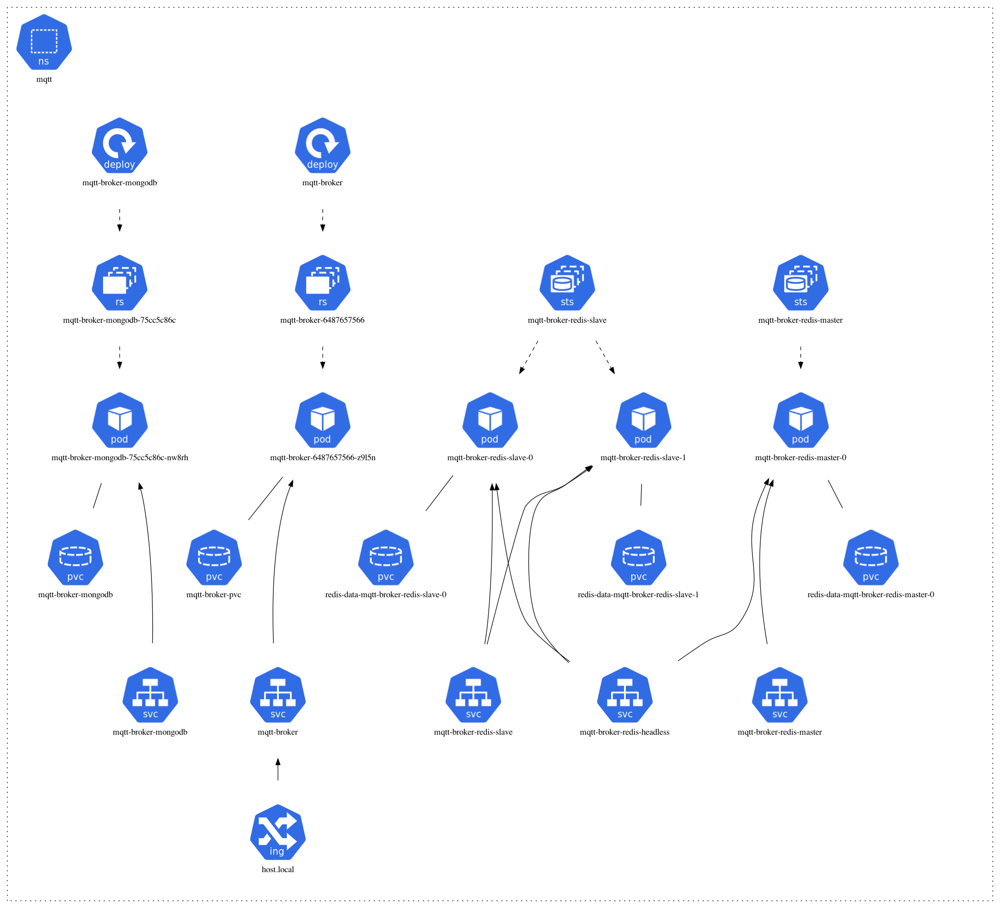

# MQTT Broker Helm Chart



## Deployment

```
git clone https://github.com/metao1/mqtt-helm-chart.git
cd mqtt-helm-chart
```
## Deploy to Kubernets cluster

Depending on which Cloud provider, on-prem or native  Kubernetes is running follow the below instructions: 

## [Minikube](https://github.com/kubernetes/minikube)

```
helm install mqtt-broker . --set global.env.HOST=host.local -n mqtt
```

The service type is [Loadbalancer](https://kubernetes.io/docs/tasks/access-application-cluster/create-external-load-balancer/). So if you plan to use [Minikube](https://github.com/kubernetes/minikube) as a test plan or like, run the below to tunnel to access external IP out of Kube Proxy.

```
minikube tunnel
```

To find the mqtt broker IP to access: 

```
kubectl get svc "mqtt-broker" -n "mqtt" -o jsonpath="{.status.loadBalancer.ingress[0].ip}"
```

The default port is `1883` and the secured port is `1884`

## AWS, GCE and Azure

To access the external IP when running on Public Clouds, read this page carefully before using it.

https://kubernetes.io/docs/tutorials/stateless-application/expose-external-ip-address/

You can use the external loadbalancer of AWS for connecting to EKS. 
To deploy the AWS load balancer controller to an Amazon EKS cluster follow this link.
https://docs.aws.amazon.com/eks/latest/userguide/load-balancing.html


## Generating certificates

Server Certificates are inside certs folder.
Don't use the default values for production. You can generate new one everytime throught below command:

`
./certs/make-keys.sh
`
